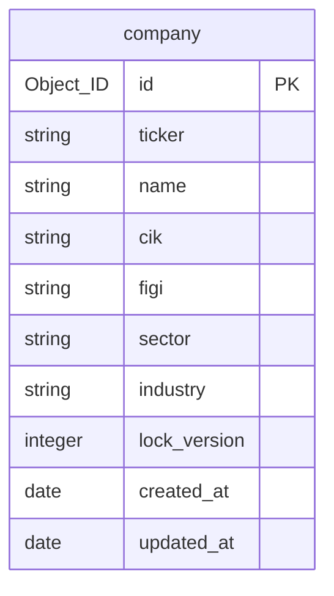
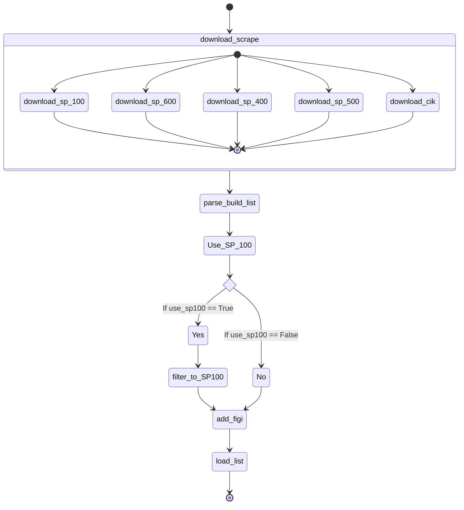

# Master List

While there are approximately 4,000 publicly listed companies in the US but the public are generally interesed in 
an investment quality subset of this list.  This application attempts to limit its support to this subset by define 
a list companies it will provide information and analysis on.  This list is called the master list.  This list is based 
on the components of the S&P 600, S&P 400 and the S&P 500 indices.

## Definition

The entry for each member of the list contains the following attributes:

## Data Sources

The application relies on the following data sources to build the list:

| Name                       | URL                                                               | Comment                                                                                                                                                                                                                                                                        |
|----------------------------|-------------------------------------------------------------------|--------------------------------------------------------------------------------------------------------------------------------------------------------------------------------------------------------------------------------------------------------------------------------|
| List of S&P 100 Components | [link](https://en.wikipedia.org/wiki/S%26P_100)                   | The S&P 100, a subset of the S&P 500, includes 101 (because one of its component companies has 2 classes of stock) leading U.S. stocks with exchange-listed options.                                                                                                           |
| List of S&P 600 Components | [Link](https://en.wikipedia.org/wiki/List_of_S%26P_600_companies) | The S&P 600 is an index of small-cap company stocks created by Standard & Poor's.                                                                                                                                                                                              |
| List of S&P 400 Components | [Link](https://en.wikipedia.org/wiki/List_of_S%26P_400_companies) | The index, maintained by S&P Dow Jones Indices, comprises the common stocks of 400 mid-cap, mostly American, companies.                                                                                                                                                        |
| List of S&P 500 Components | [Link](https://en.wikipedia.org/wiki/List_of_S%26P_500_companies) | It comprises 504 common stocks which are issued by 500 large-cap companies traded on American stock exchanges (including the 30 companies that compose the Dow Jones Industrial Average). The index includes about 80 percent of the American equity market by capitalization. |
| Company Tickers            | [Link](https://www.sec.gov/file/company-tickers)                  | Maps company symbols to SEC CIKs numbers                                                                                                                                                                                                                                       |
| OpenFIGI                   | [Link](https://www.openfigi.com)                                  | Used to look up the company's FIGI number                                                                                                                                                                                                                                      |

## Process

